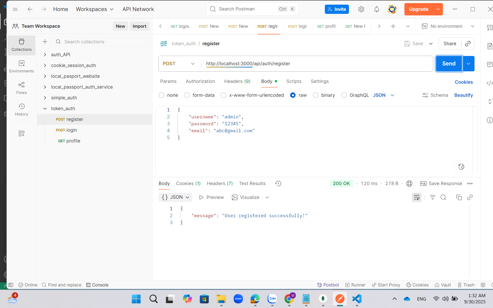
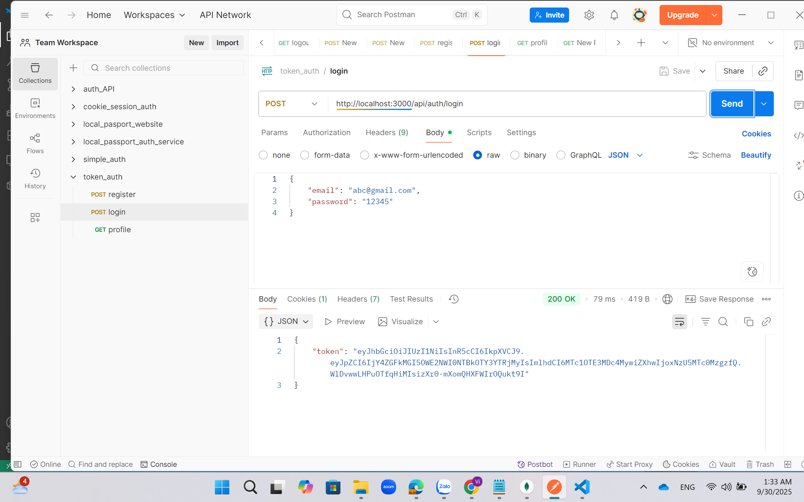
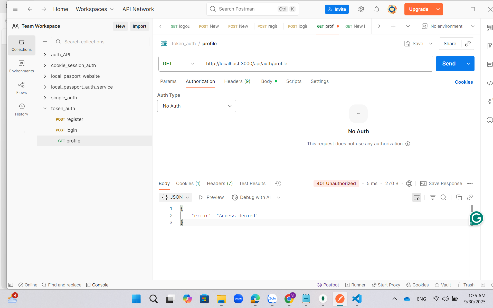
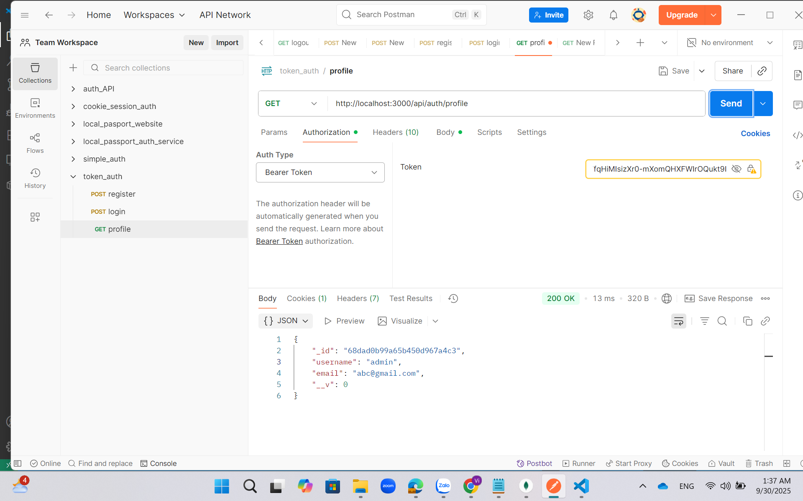

# Token Authentication Lab
Demo project về **JWT/Token-based Authentication** với Node.js + MongoDB.  
Ứng dụng minh họa các bước đăng ký, đăng nhập và truy cập profile với token.
---
## How to run

```bash
npm install
node app.js
### Register
POST `http://localhost:3000/register`  
Body JSON: `{ "username": "bob", "password": "12345" }`  



---

### Login
POST `http://localhost:3000/login`  
Body JSON: `{ "username": "bob", "password": "12345" }`  



---

### Profile (No Token)
GET `http://localhost:3000/profile` (không gửi token)  



---

### Profile (With Token)
GET `http://localhost:3000/profile` với header `Authorization: Bearer <token>`  



## commit on github
git init
git add .
git commit -m "Token auth lab"
git remote add origin https://github.com/an204-ai/token_auth
git branch -M main
git push -u origin main
